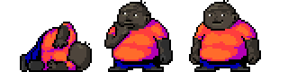

<meta charset="UTF-8">

# Screen Mate Dude

A skin for _STRAY SHEEP The Screen Mate_

# Quick how to use:

1. Left mouse button - Drag Dude around
2. LMB (Double click) - Settings menu, contains:
    * Toggle sound (might be loud)
     * Debug window to try out all the animations
    * Remove Dude
3. RMB (Double click) - Remove Dude
    
    and when dude is stuck under taskbar, task manager is your friend :)

For more information, check the original

## Copyright information and credits

Original codebase owned by Village Center, Inc. (defunct)

All character sprites in bitmap images owned by Fuji Television Network, Inc. and Robot Communications Inc.

Artwork: NOMURA Tatsutoshi (Robot)

Producer: SAITŌ Akimi (Fuji TV)

Poe's voice: HARA Masumi

(Fork of: https://github.com/lwu309/Scmpoo, _Dude is just a skin_)

Skin made by Mwti

with love, for jacex

